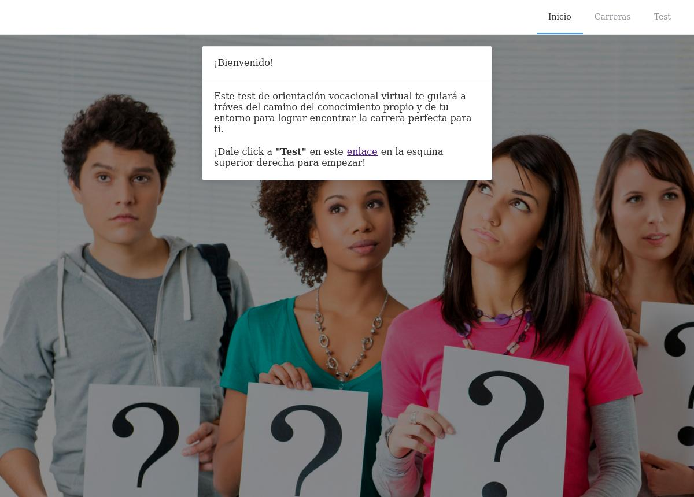
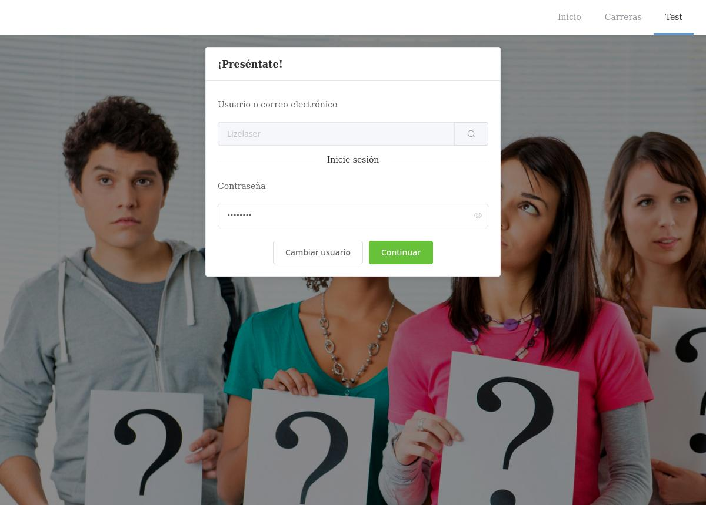
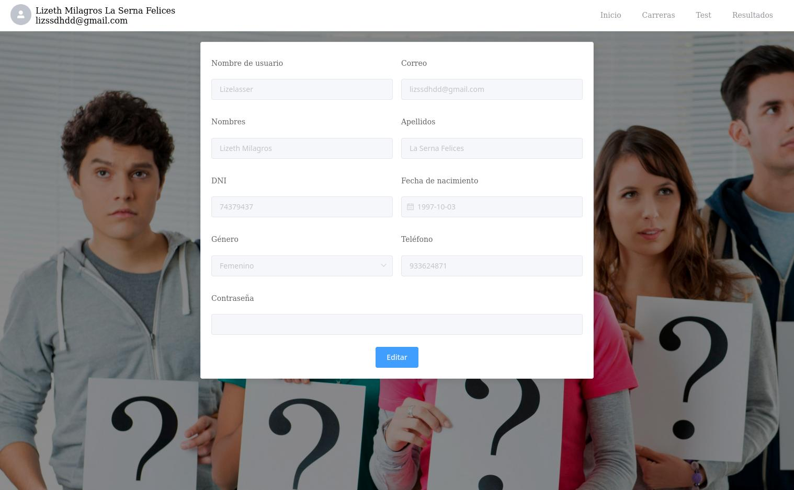
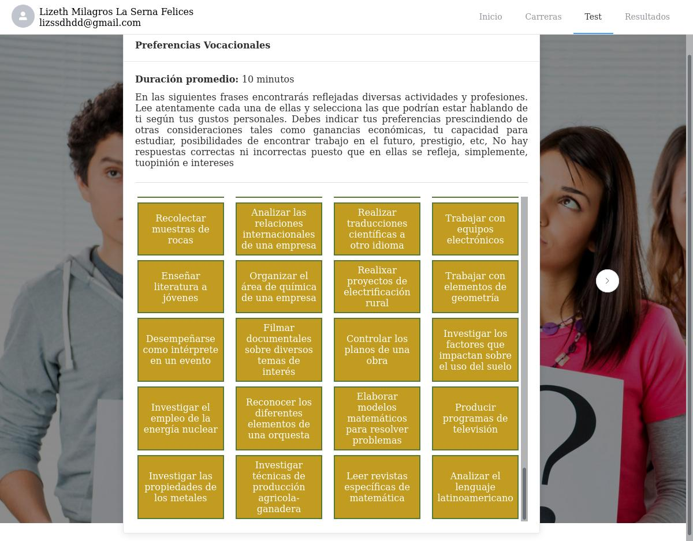
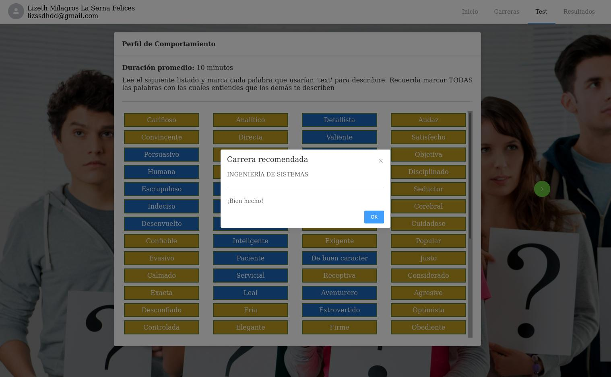

# Vocational guidance system - Descubre
> Vocational Guidance application containing psychometric test sections and career information as a guide for students.

## Table of Contents
* [General Info](#general-information)
* [Requirements](#requirements)
* [Initial Architecture](#initial-architecture)
* [Technologies Used](#technologies-used)
* [Features](#features)
* [HTTP API](#http-api)
* [Interfaces](#interfaces)
* [Setup](#setup)
* [Project Status](#project-status)
* [Room for Improvement](#room-for-improvement)
* [Contact](#contact)


## General Information

### **Problem**
<p align="justify">The lack of vocational orientation in young people in the pre-university stage can be attributed to the problem of choosing a career that is not in accordance with their interests, abilities and aptitudes. An erroneous career decision could lead to various problems in the course of the decision-maker's personal, university and work life, such as desertion, poor university performance, work frustration, repercussions on physical health, stress, anxiety, poor work performance, feelings of failure and personal dissatisfaction.</p>

### **Objectives**
<p align="justify">The objective of this project is to develop a vocational guidance application with web technologies, based on psychometric tests of vocational preferences, aptitudes and behavioral profile, with the purpose of supporting pre-university students in the choice of a university or technical career.</p>


## Requirements


|   **User story**                |          **Description**         |
| ------------------------------- | -------------------------------- |
| Register student information    | The user (student) will be able to register his        personal data (user name, e-mail, father's last name, mother's last name, first names, telephone number, e-mail) in the system. |
| Record student psychology test  | The user (student) will be able to perform the different tests (preferences, aptitudes, behavioral profile) of the vocational orientation. |
| Display information on university careers | The user (student) will be able to visualize the professional profile of each university career. |
| Show final test report of the vocational orientation process. | The user (student) will be able to visualize the results (preferences, aptitudes and professional careers) according to the psychological tests. |
| Print final report | The user (student) will be able to print the final report of the vocational orientation process. |
| Login | The user (student) will be able to authenticate himself/herself to log in to the application. |
| Log out | The user (student) will be able to log out to the application. |


## Technologies Used

- Vue - version 3.2.2
- Axios - version 0.21.1
- Vite - version 2.4.2
- Element-Plus - version 1.0.2-beta.70
- Sass - version 1.35.2

## Features
- Login
- Account creation for student
- Show profile
- Register response of
- Record test response
- view career information
- Show final test result

## HTTP API

According to the requirements, the api must contain the following end points.

#### **`Home`**

* `GET /`

#### **`Login`**

* `POST /login`

#### **`User`**

* `GET /user`
* `GET /user/:id`
* `POST /user`
* `PUT /user/:id`
* `DELETE /user/:id`

#### **`Role`**

* `GET /role`
* `GET /role/:id`
* `POST /role`
* `PUT /role/:id`
* `DELETE /role/:id`

#### **`Institution`**

* `GET /instituion`
* `GET /institution/:id`
* `POST /institution`
* `PUT /institution/:id`
* `DELETE /institution/:id`

#### **`Career`**

* `GET /career`
* `GET /career/:id`
* `POST /career`
* `PUT /career/:id`
* `DELETE /career/:id`

#### **`Test`**

* `GET /test`
* `GET /test/:id`
* `POST /test`
* `PUT /test/:id`
* `DELETE /test/:id`

#### **`Alternative`**

* `GET /alternative`
* `GET /alternative/:id`
* `POST /alternative`
* `PUT /alternative/:id`
* `DELETE /alternative/:id`

#### **`Result`**

* `GET /result`
* `GET /result/:id`
* `POST /result`

#### **`Recommendation`**

* `GET /recommendation`
* `GET /recommendation/:id`
* `POST /recommendation`


## Setup

### **Get the repository locally**
Fist ofall, clone the repo via [github-cli](https://cli.github.com/)
  ```bash
  gh repo clone lizelaser/descubre-front-end
  ```
  OR

  ```bash
  git clone https://github.com/lizelaser/descubre-front-end.git
  ```

### **Install dependencies**
Then you need to install the dependencies for the project:
  ```bash
  # npm
  npm install
  # yarn
  yarn install # OR yarn
  ```

## Usage

### Build and launch for development
Start a development server with hot-reload for development and launch the project on localhost:3000;

```bash
#npm
npm run dev

#yarn
yarn dev
```

### Build and minifies for production
Build the project in ready-to-serve minified and static files ind dist/ folder:

```bash
#npm
npm run build

#yarn
yarn run build
```

## Interfaces

### **Home**


### **Login**


### **Register user**


### **Psychometric tests**


### **Recommendation**



## Project Status

[](https://www.repostatus.org/#active)


## Room for Improvement

Room for improvement:
- Serve to production on live environment

To do:
- Automating tests that include other influential variables in vocational guidance


## Contact

Lizeth La Serna - [@lizelaser](https://github.com/lizelaser) - lizeth.lasernafelices@gmail.com

Project Link: [https://github.com/lizelaser/descubre-front-end](https://github.com/lizelaser/descubre-front-end.git)

